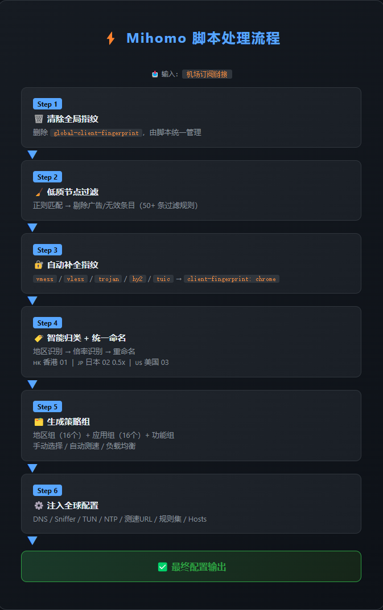

# Mihomo (Clash Meta) 智能预处理脚本

<p align="center">
  
  
  
  
  
</p>

<p align="center">
  <b>🚀 一键接管机场原始订阅，自动重命名、过滤、分流、DNS 防污染，开箱即用。</b>
</p>

<p align="center">
  <b>📦 提供「脚本」与「纯配置」两种形态，适配不同客户端 · GitHub Actions 全自动化维护</b>
</p>

---

## 目录

- [简介](#简介)
- [效果对比](#效果对比)
- [支持的服务与应用](#支持的服务与应用)
- [核心特性](#核心特性)
- [处理流程图](#处理流程图)
- [快速上手](#快速上手)
  - [法一：脚本（推荐）](#法一脚本推荐)
  - [法二：纯配置文件](#法二纯配置文件)
- [客户端兼容性](#客户端兼容性)
- [个性化定制](#个性化定制)
- [脚本维护与更新](#脚本维护与更新)
- [鸣谢](#鸣谢)
- [许可证](#许可证)

---

## 简介

这是一个专为 **Mihomo (Clash Meta)** 内核设计的 **JavaScript 订阅预处理脚本**，同时提供由脚本自动生成的 **YAML 纯配置文件**。

大多数机场的原始订阅配置节点名称带有广告尾巴、过期通知混在节点列表里、缺少分流策略，DNS 容易泄漏污染，无法满足使用需求。

本项目主要用于接管机场的原始订阅配置，通过自动执行**节点重命名、无效节点过滤、精细化策略组分流、智能 DNS 配置**，彻底解决原始订阅杂乱无章的问题，为您提供开箱即用的极致网络体验。

> **两种形态**：
> - **脚本**（`Mihomo-Script-Rules.js`）：根据节点名动态生成地区策略组，推荐大多数用户使用
> - **纯配置**（`Config/mihomoConfig.yaml`）：静态配置，适用于不支持 JS 脚本的客户端，需自行填入节点

---

## 效果对比

### 策略组：处理前 vs 处理后

|     | 处理前 | 处理后 |
| --- | --- | --- |
| 顶级分组 | 列表杂乱 | 按国家/地区 → 按应用 |
| 地区分组 | 无 | 共 16 个国家/地区 |
| 应用分组 | 无 | 16 个独立应用策略组 |
| 节点选择 | 手动选择 | 按地区自动测速 → 自动选最快节点 |
| 节点命名 | 信息杂乱 | `香港 01` `日本 03 0.5x` |

### 节点命名：处理前 vs 处理后

```
处理前：
  香港 01 | 高速节点 | 官网 www.xxx.com | 剩余流量 50GB
  日本 03 0.5x | 联系客服 @xxxx
  美国 05 | 到期时间 2024-12-31

处理后：
  🇭🇰 香港 01
  🇯🇵 日本 01 0.5x
  🇺🇸 美国 01
```

---

## 支持的服务与应用

脚本为以下 **16 个服务/应用** 自动创建独立策略组，各自使用专属规则集精准分流：

| 服务  | 策略组名称 | 规则来源 | 特殊处理 |
| --- | --- | --- | --- |
| AI 服务 | `AI` | `category-ai-!cn` | ChatGPT、Claude、Gemini 等 |
| YouTube | `YouTube` | `geosite:youtube` | —   |
| FCM 推送 | `FCM` | `geosite:googlefcm` | 保障 Android 推送 |
| Google | `Google` | `geosite:google` + `geoip:google` | 域名 + IP 双重匹配 |
| GitHub | `GitHub` | `geosite:github` | —   |
| Microsoft | `Microsoft` | `geosite:microsoft` | —   |
| Apple | `Apple` | `geosite:apple` | —   |
| Telegram | `Telegram` | `geosite:telegram` + `geoip:telegram` | 域名 + IP 双重匹配 |
| Cloudflare | `Cloudflare` | `geosite:cloudflare` + `geoip:cloudflare` | 域名 + IP 双重匹配 |
| Steam | `Steam` | `geosite:steam` | —   |
| X | `X` | `geosite:twitter` + `geoip:twitter` | 域名 + IP 双重匹配 |
| Instagram | `Instagram` | `geosite:instagram` | —   |
| Spotify | `Spotify` | `geosite:spotify` | —   |
| TikTok | `TikTok` | `geosite:tiktok` | —   |
| Netflix | `Netflix` | `geosite:netflix` + `geoip:netflix` | 域名 + IP 双重匹配 |
| 广告拦截 | `广告拦截` | `adblockmihomolite` | 默认 REJECT，可手动切换 |

> 每个服务策略组都包含 **自动选择**、**负载均衡**、**直连** 三个子选项，可按需切换。

### 支持的国家/地区（16 个）

🇭🇰 香港 · 🇯🇵 日本 · 🇺🇸 美国 · 🇸🇬 新加坡 · 🇹🇼 台湾 · 🇰🇷 韩国 · 🇬🇧 英国 · 🇩🇪 德国 · 🇫🇷 法国 · 🇨🇦 加拿大 · 🇦🇺 澳大利亚 · 🇮🇳 印度 · 🇹🇷 土耳其 · 🇧🇷 巴西 · 🇦🇷 阿根廷 · 🇷🇺 俄罗斯

每个地区自动生成三个策略组：**手动选择** → **自动测速** → **负载均衡**。

---

## 核心特性

### 节点智能归类与统一命名

- 根据节点名称中的关键词（中文、英文、国旗 Emoji）自动识别所属国家/地区
- 自动剥离机场广告、联系方式、流量信息等杂余内容（内置 50+ 条过滤正则）
- 倍率自动识别：低倍率（0.1x ~ 0.5x）、高倍率（2x+）节点自动标记
- 统一命名格式：`[国旗] [地区名] [序号] [倍率]`
  - 普通节点：`🇭🇰 香港 01`
  - 低倍率节点：`🇯🇵 日本 02 0.5x`
  - 高倍率节点：`🇺🇸 美国 03 3x`
- 无法识别地区的节点归类为 `🌐 其他 01`

### 低质节点过滤

内置强力正则 `excludeFilter`，自动过滤包含以下关键词的无效条目：

`群` `返利` `循环` `官网` `客服` `网址` `获取` `订阅` `流量` `到期` `机场` `备用` `过期` `联系` `邮箱` `工单` `通知` `频道` `教程` `福利` `邀请` `剩余` `公益` `Expire` `⚠️` `@` 以及 URL 等

### 策略组分流

- 每个地区生成 3 层策略组：**手动选择 (Select)** → **自动测速 (URL-Test)** → **负载均衡 (Load-Balance)**
- 自动测速间隔 180 秒，延迟容忍度 50ms，3 次失败后切换
- 负载均衡采用 `sticky-sessions` 策略，同域名固定走同一节点
- 全局 GLOBAL 组包含所有功能组和地区组

### DNS 防污染

```
国内域名 → 阿里 DNS / DNSPod (DoH) → 直连
国外域名 → Google DNS / Cloudflare (DoH) → 代理
```

- **Fake-IP 模式**，缓存算法 ARC
- `nameserver-policy` 精准分流：gfw 列表走国外 DNS，cn/private 列表走国内 DNS
- `proxy-server-nameserver` 兜底：避免代理服务器 DNS 请求走代理本身
- `direct-nameserver-follow-policy`：直连请求跟随策略选择 DNS

### 广告拦截

- 深度集成 [adblockmihomolite](https://github.com/217heidai/adblockfilters) 规则集
- 每 12 小时自动更新一次规则
- 策略组默认 REJECT，可随时切换到直连或代理

### 自动补全客户端指纹

针对 `vmess`、`vless`、`trojan`、`hysteria2`、`hy2`、`tuic` 协议，自动补全 `client-fingerprint: chrome`，降低 TLS 指纹被识别和阻断的风险。

### QUIC 管控

```
AND,((NETWORK,UDP),(DST-PORT,443)),QUIC处理
```

UDP 443 (QUIC) 流量集中拦截到独立策略组，默认走代理。可手动切换到 REJECT 彻底阻断 QUIC，解决部分环境下 QUIC 导致网页加载卡顿的问题。

### 双栈 & TUN 模式

- 注入三个直连节点：
  - `🇨🇳 直连 | IPv4优先` → 优先使用 IPv4
  - `🇨🇳 直连 | IPv6优先` → 优先使用 IPv6
  - `🇨🇳 直连 | 双栈` → IPv4/IPv6 自动选择
- TUN 模式一键开关（`tunEnable` 常量），电脑端推荐开启

### 规则自动更新

所有分流规则集每 **24 小时**自动更新（广告拦截每 12 小时），来源包括：

- [MetaCubeX/meta-rules-dat](https://github.com/MetaCubeX/meta-rules-dat)（geosite/geoip 核心规则）
- [wwqgtxx/clash-rules](https://github.com/wwqgtxx/clash-rules)（直连/GFW 规则）
- [217heidai/adblockfilters](https://github.com/217heidai/adblockfilters)（广告拦截规则）
- [AIsouler/MyClash](https://github.com/AIsouler/MyClash)（下载类应用规则）

### 其他

- **Sniffer 域名嗅探**：HTTP/TLS/QUIC 自动嗅探真实域名
- **NTP 时间同步**：每 30 分钟通过阿里 NTP 同步，防止系统时间不准导致证书错误
- **Hosts 硬编码**：防止 DNS 污染导致 DNS 服务器本身解析失败
- **节点图标**：每个策略组配有 Qure 精美图标
- **测速 URL 国内外分流**：国外节点用 Cloudflare，国内节点用华为
- **统一延迟测试**：`unified-delay` 开启，TCP 并发测试

---

## 处理流程图



---

## 快速上手

提供两种使用方式，根据客户端支持情况选择：

### 法一：脚本（推荐）

适用于支持 JS 预处理的客户端（Bettbox / FlClash / Clash Verge Rev 等）。脚本会根据节点名动态生成地区策略组，自动化程度最高。

#### 1. 获取脚本链接

**主链接（GitHub Raw）：**

```
https://raw.githubusercontent.com/zzzhhe123/Mihomo-Script-Rules/refs/heads/main/Mihomo-Script-Rules.js
```

**CDN 加速镜像（推荐国内用户使用）：**

```
https://fastly.jsdelivr.net/gh/zzzhhe123/Mihomo-Script-Rules@main/Mihomo-Script-Rules.js
```

#### 2. 在客户端中导入

**Bettbox / FlClash：**

1. 进入 APP → 点击底部 **更多**
2. 找到 **脚本** 功能入口 → 点击右下角 **+** → 选择 **通过 URL 导入**
3. 粘贴上述脚本链接 → 命名 → **保存**
4. **脚本** 功能页中，将刚保存的脚本 **开关** 打开
5. **代理** 页可选择节点及策略

**Clash Verge / Clash Nyanpasu / Clash Verge Rev：**

1. 进入 **配置** 页面 → 找到你的订阅配置
2. 点击编辑 → 在 **预处理脚本** 处填入脚本链接
3. 保存并更新订阅

### 法二：纯配置文件

适用于不支持 JS 脚本的客户端，或不想用脚本的用户。配置文件由脚本自动生成，但**不含动态地区分组**（需手动填入节点）。

#### 1. 获取配置文件链接

**主链接：**

```
https://raw.githubusercontent.com/zzzhhe123/Mihomo-Script-Rules/refs/heads/main/Config/mihomoConfig.yaml
```

**CDN 加速镜像：**

```
https://fastly.jsdelivr.net/gh/zzzhhe123/Mihomo-Script-Rules@main/Config/mihomoConfig.yaml
```

#### 2. 使用方式

1. 下载上述 yaml 文件
2. 将文件中 `proxies` 部分替换为你自己的节点（从机场订阅获取）
3. 导入到客户端即可使用

> **纯配置与脚本的差异**：纯配置无法根据节点名自动生成地区策略组，未匹配到节点的策略组会回退到 REJECT。如果客户端支持脚本，强烈建议用方式一。

#### Stash / Shadowrocket / Surge 等其他客户端

> ⚠️ 这些客户端不完全兼容 Mihomo 的 JS 预处理语法。建议改用 **订阅转换工具**（如 sub-store），将脚本挂载在转换流程中，或直接使用上方的纯配置文件。

---

## 客户端兼容性

| 客户端 | 兼容性 | 备注  |
| --- | --- | --- |
| [Bettbox](https://github.com/appshubcc/Bettbox) | 完美 | **强烈推荐**，原生支持 JS 脚本预处理 |
| [FlClash](https://github.com/chen08209/FlClash) | 完美 | **强烈推荐**，原生支持 JS 脚本预处理 |
| [Clash Verge Rev](https://github.com/clash-verge-rev/clash-verge-rev) | 兼容 | 需在配置编辑中手动设置预处理脚本 |
| [Clash Nyanpasu](https://github.com/libnyanpasu/clash-nyanpasu) | 兼容 | 同上  |
| [Clash Verge](https://github.com/clash-verge-rev/clash-verge-rev) | 旧版 | 旧版可能不支持，建议升级到 Verge Rev |
| Stash / Shadowrocket | 不兼容 | JS 预处理语法不同，建议用 sub-store 中转 |
| Surge / Quantumult X | 不兼容 | 同上  |

---

## 个性化定制

脚本开头定义了所有可配置常量，直接编辑即可自定义。

### 策略组开关 (`ruleOptionsEnable`)

控制每个应用策略组是否开启。设为 `false` 可禁用不需要的服务，减少策略组数量。

```javascript
const ruleOptionsEnable = {
  ai: true,           // AI 服务 (ChatGPT, Claude, Gemini…)
  youtube: true,      // YouTube
  googlefcm: true,    // FCM 推送 (Android 必备)
  google: true,       // Google 搜索
  github: true,       // GitHub
  microsoft: true,    // Microsoft 服务
  apple: true,        // Apple 服务
  telegram: true,     // Telegram
  twitter: true,      // X (Twitter)
  instagram: true,    // Instagram
  steam: true,        // Steam
  cloudflare: true,   // Cloudflare
  spotify: true,      // Spotify
  tiktok: true,       // TikTok
  netflix: true,      // Netflix
  adblock: true,      // 广告拦截
};
```

### 地区策略组开关 (`regionDefinitionsEnable`)

控制哪些国家/地区生成独立的节点策略组。不需要的地区设为 `false` 即可。

```javascript
const regionDefinitionsEnable = {
  香港: true,
  日本: true,
  美国: true,
  新加坡: true,
  台湾: true,
  韩国: true,
  英国: true,
  德国: true,
  法国: true,
  加拿大: true,
  澳大利亚: true,
  印度: true,
  土耳其: true,
  巴西: true,
  阿根廷: true,
  俄罗斯: true,
  低倍率节点: true,   // 自动识别 0.1x ~ 0.5x 的低倍率节点
  高倍率节点: true,   // 自动识别 2x+ 的高倍率节点
};
```

### 全局开关

| 常量  | 作用  | 默认值 | 推荐  |
| --- | --- | --- | --- |
| `excludeFilterEnable` | 是否开启杂质节点过滤 | `true` | 始终开启 |
| `tunEnable` | TUN 模式开关 | `false` | 电脑端建议 `true`，手机端保持 `false` |

### 杂质过滤正则 (`excludeFilter`)

如果你想自定义过滤规则，修改此正则。匹配到以下关键词的节点会被自动移除：

```javascript
const excludeFilter = /群|返利|循环|官[网址]|客服|网站|网址|获取|订阅|流量|到期|机场|下次|备用|过期|已用|联系|邮箱|工单|通知|防止|国内|地址|频道|无法|说明|使用|提示|特别|访问|教程|关注|更新|作者|加入|超时|收藏|福利|邀请|好友|选择|剩余|公益|发布|DIZTNA|通路|登录|禁止|定时|渠道|牢记|永久|余额|阁下|本站|刷新|导航|⚠️|@|Expire|https?:\/\/|www\.|\.com(?:$|[^a-zA-Z0-9])/u;
```
---

## 脚本维护与更新

- 本脚本持续维护
- 规则集（geosite/geoip/广告拦截）由上游项目自动更新，脚本本身无需频繁改动
- 如果你发现某个服务的分流规则过时或有更好的替代规则集，欢迎提 **Issue**

---

## 鸣谢

本项目的诞生离不开以下优秀开源项目：

| 项目  | 用途  | 链接  |
| --- | --- | --- |
| **MyClash** | 原始代码来源，核心逻辑参考 | [AIsouler/MyClash](https://github.com/AIsouler/MyClash) |
| **Mihomo** | 内核支持 | [MetaCubeX/mihomo](https://github.com/MetaCubeX/mihomo) |
| **Qure** | 精美图标库 | [Koolson/Qure](https://github.com/Koolson/Qure) |
| **Meta 规则集** | geosite / geoip 规则数据 | [MetaCubeX/meta-rules-dat](https://github.com/MetaCubeX/meta-rules-dat) |
| **Clash 规则集** | 直连 / fakeip / GFW 规则 | [wwqgtxx/clash-rules](https://github.com/wwqgtxx/clash-rules) |
| **广告过滤规则** | Mihomo 广告拦截规则 | [217heidai/adblockfilters](https://github.com/217heidai/adblockfilters) |
| **Bettbox** | 推荐客户端 | [appshubcc/Bettbox](https://github.com/appshubcc/Bettbox) |

---

## 许可证

本项目基于 **MIT License** 开源。详见 [LICENSE](./LICENSE) 文件。

你可以自由使用、修改、分发本项目的代码，只需保留原始版权声明。本项目不提供任何担保。

---

<p align="center">
  <sub>Made with ❤️ by <a href="https://github.com/zzzhhe123">zzzhhe123</a> | 如果觉得好用，给个 ⭐ Star 吧！</sub>
</p>
